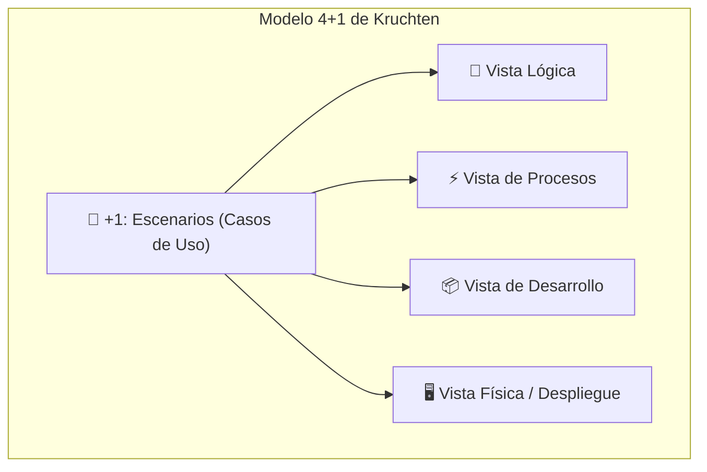
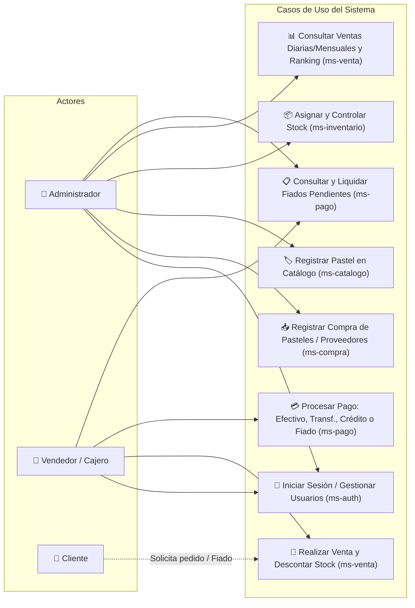
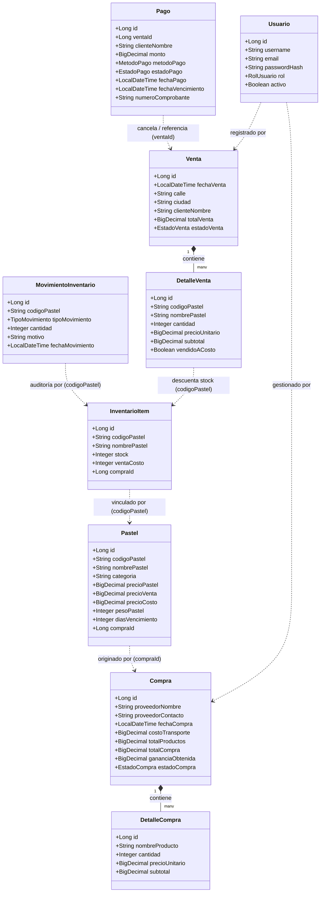
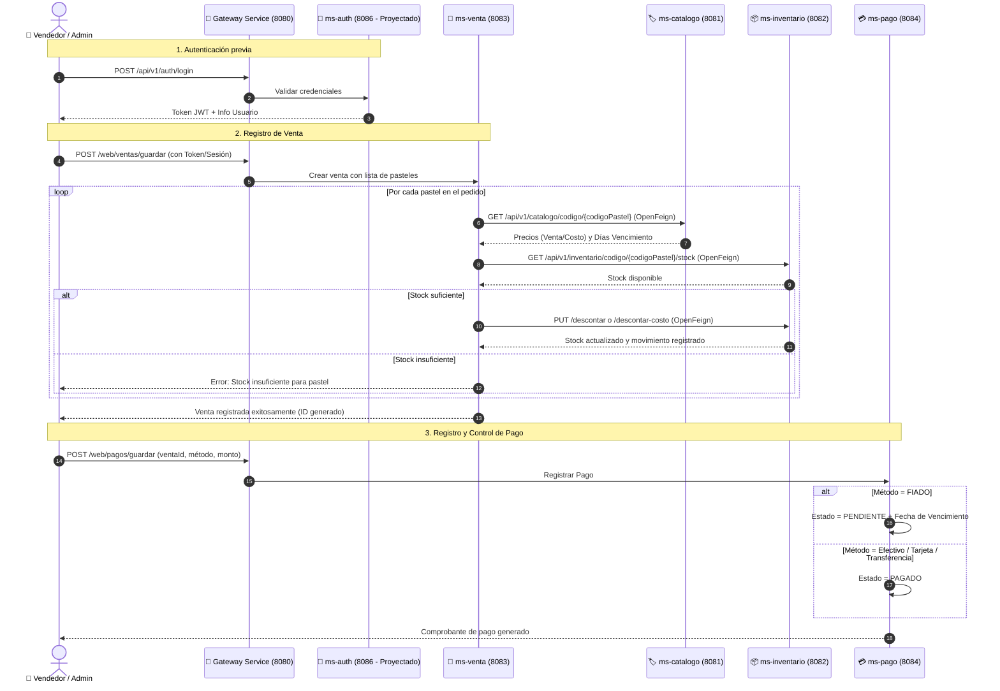
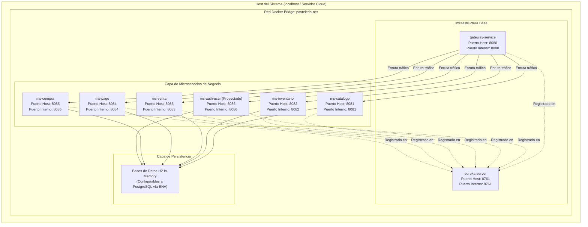

# 🍰 Pastelería Las Melosas — Arquitectura de Microservicios

Sistema integral de gestión para la pastelería **"Las Melosas"**, desarrollado bajo una arquitectura de microservicios con **Spring Boot 3.4**, **Spring Cloud 2024**, **Java 21**, **Docker** y una interfaz web con **Thymeleaf** estilizada mediante **Bootstrap 5**.

---

## 📐 Modelo de Vistas de Arquitectura 4+1 (Kruchten)

El modelo **4+1** describe la arquitectura del software mediante 5 perspectivas complementarias que satisfacen las necesidades de los distintos interesados (usuarios, desarrolladores, integradores e ingenieros de sistemas).

> [!NOTE]
> En todos los diagramas se incorpora el microservicio planificado **`ms-auth` / `ms-user`** (gestión de usuarios, roles y autenticación JWT), proyectado para ser integrado en la siguiente fase del proyecto.



---

### 1. 🎯 Vista de Escenarios (+1: Casos de Uso)
Representa los requerimientos funcionales del sistema desde la perspectiva de los usuarios finales (Administrador, Vendedor/Cajero y Cliente).



---

### 2. 🧠 Vista Lógica (Logical View)
Describe la estructura de clases, entidades de dominio y sus relaciones conceptuales. Muestra cómo se organiza la información dentro de cada microservicio.



---

### 3. ⚡ Vista de Procesos (Process View)
Describe la concurrencia, comunicación entre servicios y el flujo dinámico de ejecución en tiempo real mediante llamadas REST internas (OpenFeign) y enrutamiento por el Gateway.

#### Flujo Principal: Autenticación, Venta, Descuento de Stock y Pago



---

### 4. 📦 Vista de Desarrollo / Implementación (Development View)
Muestra la organización del código fuente en subsistemas, módulos y paquetes siguiendo la arquitectura por capas **MVC limpia** exigida para cada microservicio.

```mermaid
graph TD
    subgraph "Organización de Módulos (Maven Multi-Project)"
        ERK["eureka-server (Service Discovery)"]
        GTW["gateway-service (API Gateway & Routing)"]
        AUTH["ms-auth-user (Seguridad & Roles - Planificado)"]
        COMP["ms-compra (Compras a Proveedores)"]
        CAT["ms-catalogo (Catálogo y Vencimiento)"]
        INV["ms-inventario (Bodega y Kardex)"]
        VENT["ms-venta (Ventas, Lugares y Estadísticas)"]
        PAGO["ms-pago (Pagos, Comprobantes y Fiados)"]
    end

    subgraph "Estructura Estándar de Capas en cada Microservicio"
        direction TB
        PK_CFG["config (OpenAPI / Swagger, Security)"]
        PK_ENUM["enums (Constantes y Estados)"]
        PK_MODEL["model (Entidades JPA con atributos puros)"]
        PK_REPO["repository (Spring Data JPA Repositories)"]
        PK_DTO["dto (Data Transfer Objects con Validaciones)"]
        PK_MAP["mapper (Conversión Entity <-> DTO)"]
        PK_SRV["service + service.impl (Lógica de Negocio)"]
        PK_CLT["client (Clientes OpenFeign inter-servicio)"]
        PK_EXP["exception (Excepciones de Negocio y Global Handler)"]
        PK_CTRL["controller (REST API)"]
        PK_WEB["controller.web (Controladores Web Thymeleaf)"]
        PK_TMP["resources/templates (Vistas HTML con Bootstrap 5)"]
    end

    COMP -.-> PK_MODEL
    CAT -.-> PK_MODEL
    INV -.-> PK_MODEL
    VENT -.-> PK_MODEL
    PAGO -.-> PK_MODEL
    AUTH -.-> PK_MODEL
```



---

### 5. 🖥️ Vista Física / Despliegue (Physical / Deployment View)
Ilustra la infraestructura física y de contenedores Docker, la red virtual compartida (`pasteleria-net`), los puertos expuestos en el Host y la orquestación mediante Docker Compose.



---

## 🚀 Guía de Puesta en Marcha

### Opción 1: Con Docker Compose (Recomendado)

Para compilar las imágenes limpias desde cero y levantar todos los contenedores:

```powershell
# 1. Asegúrate de tener Docker Desktop abierto
# 2. Reconstruye sin caché y levanta
docker compose build --no-cache && docker compose up
```

Para detener los servicios:
```powershell
docker compose down
```

---

### Opción 2: Ejecución Local en Desarrollo (Maven)

1. **Paso 1: Levantar Eureka Server (obligatorio primero)**
   ```powershell
   cd eureka-server; .\mvnw spring-boot:run
   ```

2. **Paso 2: Levantar los microservicios necesarios (en terminales separadas)**
   ```powershell
   cd ms-compra;     .\mvnw spring-boot:run
   cd ms-catalogo;   .\mvnw spring-boot:run
   cd ms-inventario; .\mvnw spring-boot:run
   cd ms-venta;      .\mvnw spring-boot:run
   cd ms-pago;       .\mvnw spring-boot:run
   cd gateway-service; .\mvnw spring-boot:run
   ```

---

## 🌐 Puertos y Rutas de Acceso Web

| Microservicio | Puerto | URL Web (Thymeleaf + Bootstrap) | Swagger / OpenAPI |
|---|:---:|---|---|
| **Eureka Server** | `8761` | `http://localhost:8761` | Dashboard Eureka |
| **API Gateway** | `8080` | `http://localhost:8080` | Enrutador Central |
| **ms-compra** | `8085` | `http://localhost:8085/web/compras` | `http://localhost:8085/swagger-ui.html` |
| **ms-catalogo** | `8081` | `http://localhost:8081/web/catalogo` | `http://localhost:8081/swagger-ui.html` |
| **ms-inventario** | `8082` | `http://localhost:8082/web/inventario` | `http://localhost:8082/swagger-ui.html` |
| **ms-venta** | `8083` | `http://localhost:8083/web/ventas` | `http://localhost:8083/swagger-ui.html` |
| **ms-pago** | `8084` | `http://localhost:8084/web/pagos` | `http://localhost:8084/swagger-ui.html` |
| *ms-auth-user* | `8086` | *(Planificado)* | *(Planificado)* |